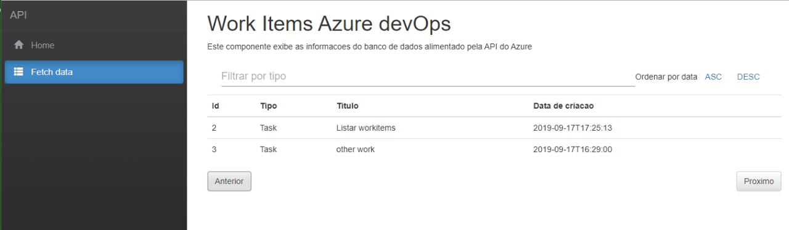

# Engenhos Test :)


`O projeto principal é o SpiderAzure, abrindo a solução no Visual Studio ele já carrega o projeto API.
`
## Configuração do SpiderAzure:

* As informações de acesso a API do Azure e do banco de dados estão localizadas no arquivo appsettings.json:

  `Altere as configurações do banco conforme necessário para testes`
  
  `Execute o arquivo SpiderAzure/DataBase/dbo.Table.sql para criar a tabela de workitems`
 
    * "DB_HOST": "localhost", // nome do host sql server
    * "DB_NAME": "AzureIntegration", // nome do banco de dados
    * "DB_USER": "sa", // nome do banco de dados
    * "DB_PASSWORD": "Password", // nome do banco de dados
    * "URI_AZURE": "https://dev.azure.com/yantadeu1", //url do azure
    * "PERSONAL_ACCESS_TOKEN": "xxw4hdxel7admik2jqfqjbmqjcuxhdwnjcdzbqploynlrwyv3gmq", //token gerado pelo azure para acesso
    * "PROJECT": "AzureInterfaceEngenhos" //nome do projeto do azure

* Dentro da pasta DataBase se encontra o sql de criação da Tabela onde serão armazenados os WorkItens.

* O Spider realiza uma busca no banco de dados, se não houver nenhum Workitem salvo, ele busca todos os workitems do azure. Se houver algum Workitem salvo, ele pega a data do Workitem com a criação mais recente e utiliza como filtro para buscar os dados no Azure, sendo assim, apenas retorna os novos Workitens.

## Configuração API e interface em React:

* As informações para acesso do banco de dados são passadas por variáveis de ambiente, e podem ser configuradas no arquivo "launchSettings.json" que se encontra dentro de "Properties":

    - "DB_HOST": "localhost", // nome do host sql server
    - "DB_NAME": "AzureIntegration", // nome do banco de dados

``` 
Ao executar o projeto API, o navegador é aberto com a lista de WorkItens. Podendo  filtrar por tipo (digitando o tipo do work item) e ordenar por data de criação, além de paginação por meio de botões. A interface é responsiva.```


